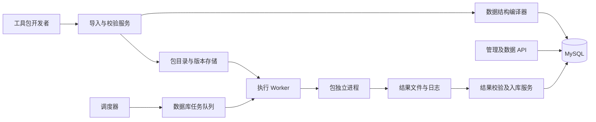
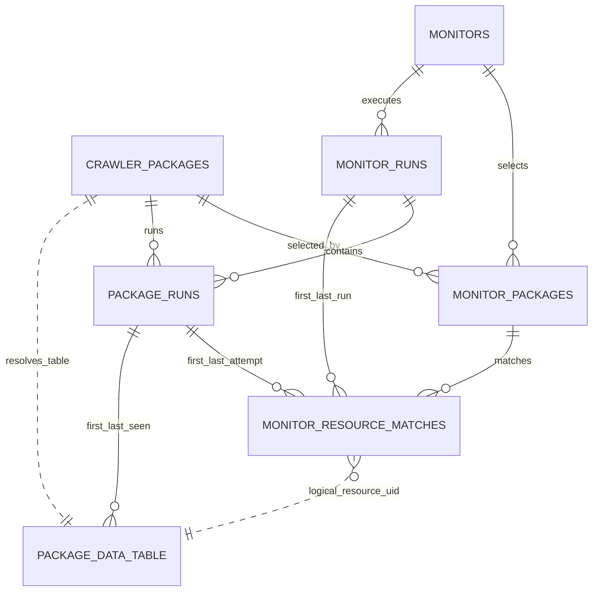

# 爬虫工具包管理与执行平台：技术设计及实施规范 v1.0

日期：2026-09-19
文档性质：当前平台的技术设计、实施与验收基线。
适用对象：后端开发、数据库开发、爬虫工具包开发、测试与部署人员。

## 1. 建设目标与设计效力

建设一个服务器端的小型爬虫管理平台。外部开发者提交包含脚本、参数说明、依赖和输出结构的工具包；平台验证并导入工具包，为每个包创建独立数据表，接受关键词监控任务，按计划启动爬虫，接收结果并提供数据查询 API。

核心验收目标：第三方按协议制作新包后，平台不修改业务代码即可完成导入、自动建表、参数校验、定时执行、数据入库和查询。

本规范替代新系统建设中的旧系统架构约束，包括旧 SourcePlugin 继承机制、每模块一张资源表、旧启动流程和旧数据库版本。新系统从独立工程和独立数据库开始，不把新架构称为旧系统 v5，不要求兼容旧面板或旧 API。

旧实验系统已经退役并删除。当前平台不兼容其代码、数据库、面板或 API，也不提供旧数据迁移路径。

### 1.1 已确认需求

- 平台管理与运行爬虫，具体网站的抓取逻辑由工具包开发者负责。
- 工具包以目录交付；上传时可使用 ZIP 容器，内容协议一致。
- 每个逻辑工具包拥有一张独立结果表。
- 用户提供关键词并选择包，平台支持手动、每日、每周执行。
- 一个任务可以包含不同业务类别的包；新闻、百科、论文、专利只是分类。
- 同一包内的数据去重；同一资源可以与多个监控任务关联。
- 尽可能保存有效采集数据，明确记录失败原因和执行进度。
- 数据存入 MySQL，通过平台 API 对外提供。
- 第一阶段不建设用户、组织、多租户、复杂前端、分析和通知系统。

### 1.2 本规范确定的第一版范围

- 当前可运行基线：Python 3.9、MySQL 5.7 / InnoDB；生产部署优先升级到受维护的 Python 与 MySQL 版本。包必须声明精确 Python major.minor，平台不在不匹配的解释器上安装。
- 第一版只运行 Python 包；协议使用文件交换，未来可扩展其他语言。
- 一个包对应一个业务分类、一种输出结构、一张结果表。
- 包可以采集多个网站，使用业务字段 source_site 区分；不按网站或执行次数新建表。
- 同包升级、重复导入及多任务使用均沿用原表。
- 初期只接收经维护人员审核的工具包。独立进程不是安全沙箱；任意不可信第三方代码接入需另行实现容器及网络隔离。
- 数据保留最新字段值和首次/最近发现信息；逐次正文版本历史不在第一版范围。

## 2. 系统组成



### 2.1 职责边界

| 组件 | 必须负责 | 不得承担 |
| --- | --- | --- |
| 导入服务 | 清单验证、包校验和、环境准备、试运行、安装状态 | 自动执行未经审核的任意安装脚本 |
| 结构编译器 | 输出声明到 MySQL 列/索引的映射、结构差异检查 | 执行工具包附带的原始 SQL |
| 调度器 | 判断到期、生成运行记录、避免重复调度 | 在 API 请求线程中直接运行爬虫 |
| Worker | 领取任务、启动进程、超时、日志、取消、恢复 | 理解百度或某个期刊的网页结构 |
| 工具包 | 请求网站、解析内容、输出协议文件 | 连接平台数据库、修改平台目录、自建定时循环 |
| 入库服务 | 校验、身份计算、去重、匹配关系、游标提交 | 自动猜测未声明的字段类型 |
| 查询 API | 包内查询、任务结果关联查询、字段映射 | 暴露任意 SQL 或真实数据库凭证 |

建议 FastAPI + Pydantic 提供 API 和请求校验；JSON Schema 校验包参数；SQLAlchemy Core 负责数据库事务与动态表；Alembic 仅管理固定系统表。动态包表由结构编译器管理，不为每个包生成手写迁移文件。先用 MySQL 任务队列，不引入 Redis、Celery 或 Kubernetes。

## 3. 工具包目录协议

```text
baidu-baike/
  manifest.json
  crawler.py
  requirements.lock
  README.md
  src/
  tests/
    request.json
    items.jsonl
    result.json
```

manifest.json、入口脚本、requirements.lock、README.md 和测试样例必须提供。无依赖时锁定文件可为空。包内辅助目录由开发者自由组织。

所有协议文件使用 UTF-8 无 BOM。包不能包含虚拟环境、平台凭证或数据库文件。上传 ZIP 必须拒绝绝对路径、上级目录跳转、符号链接/硬链接和超限解压；第一版建议压缩包上限 50 MiB、解压后 250 MiB、文件数 5000，均由平台运维配置。

### 3.1 身份及版本

- package_key：稳定身份，正则 `^[a-z][a-z0-9_]{2,63}$`，不得按标题生成或随版本改变。
- package_version：包代码版本，使用三段数字版本，例如 1.2.0。
- protocol_version：平台交换协议版本，第一版为 1.0。
- output_schema_version：包内数据结构版本，正整数。
- artifact_digest：平台对规范化目录文件清单及各文件 SHA-256 计算的总摘要；不使用 ZIP 时间戳判等。
- 同 package_key、同版本、同摘要：幂等导入；同版本不同摘要：拒绝覆盖。
- 第一版每个包仅一个激活版本；历史版本保留只读制品，用于审计和回退评估。

### 3.2 manifest.json 完整示例

```json
{
  "protocol_version": "1.0",
  "package_key": "baidu_baike",
  "package_version": "1.0.0",
  "name": "百度百科",
  "description": "根据主题词获取百科条目",
  "category": "encyclopedia",
  "runtime": {
    "type": "python",
    "python_version": "3.9",
    "entrypoint": "crawler.py",
    "dependencies": "requirements.lock"
  },
  "capabilities": {"incremental": false},
  "parameters_schema": {
    "$schema": "https://json-schema.org/draft/2020-12/schema",
    "type": "object",
    "properties": {
      "language": {"type": "string", "enum": ["zh"], "default": "zh"}
    },
    "additionalProperties": false
  },
  "secret_names": [],
  "output_schema_version": 1,
  "output_schema": {
    "fields": [
      {"name": "external_id", "type": "string", "max_length": 128, "nullable": false},
      {"name": "title", "type": "string", "max_length": 1000, "nullable": false},
      {"name": "url", "type": "text", "nullable": false},
      {"name": "summary", "type": "text", "nullable": true},
      {"name": "content", "type": "text", "nullable": true},
      {"name": "source_site", "type": "string", "max_length": 128, "nullable": true}
    ],
    "identity_fields": ["external_id"],
    "indexes": [],
    "mapping": {"title": "title", "url": "url", "summary": "summary"}
  }
}
```

清单采用平台发布的严格 JSON Schema，未知顶层字段拒绝；扩展协议必须升级版本。parameters_schema 支持 Draft 2020-12 的本地验证，不允许远程 $ref；default 由平台显式填充，不假设验证器自动填默认值。

身份字段必须已声明、不可空且为稳定标量；禁止把关键词、正文、抓取时间作为唯一身份。一个包覆盖多个站点且站点 ID 会重复时，应使用 [source_site, external_id] 联合身份。URL 作为身份时由爬虫输出稳定规范链接，不得将大小写敏感路径统一转小写。

mapping.title 必须映射到字符串或 text 字段；每条记录必须有非空展示标题。mapping.url、summary、published_at 可选且校验类型，缺失时查询 API 返回 null。不是强制所有包使用相同业务字段名。

## 4. 启动与文件交换协议

### 4.1 单次进程边界

平台使用参数数组启动，禁止 shell=True 或拼接可执行命令：

```text
<包虚拟环境>/bin/python <只读包目录>/crawler.py
  --request <绝对路径>/request.json
  --output <绝对路径>/output
```

一次进程调用负责一个有界批次，最多 request.limit 条。可在包内部翻页凑够批次；没有分页能力就返回实际可用数量。平台不能保证设定上限等于可获得数量。

同一监控任务中，每个包每次任务运行默认执行一个批次，失败可重试。不在第一版自动无限翻页；后续定时任务通过已提交 cursor 继续。包的增量游标需要能够表达历史分页位置和最新时间边界，平台视为不透明对象。

### 4.2 request.json

```json
{
  "protocol_version": "1.0",
  "execution_id": "4a67f6c0-c73d-43ea-87fd-472cf238c538",
  "package_key": "baidu_baike",
  "package_version": "1.0.0",
  "query": "人工智能",
  "aliases": ["AI"],
  "limit": 100,
  "parameters": {"language": "zh"},
  "cursor": null,
  "time_range": {"from": null, "to": null},
  "deadline_at": "2026-09-19T10:05:00Z"
}
```

query 必须非空。aliases 是任务提供的检索提示，由包按网站能力使用；第一版不承诺语义扩展或严格字符串匹配。time_range 为可选 RFC 3339 UTC 边界，含起点不含终点；不支持日期过滤的包必须给 warning，不得悄悄声称完成筛选。

参数顺序：清单默认值 -> 包全局默认配置 -> monitor_packages 任务配置 -> 本次手动覆盖；只对 parameters 顶层键覆盖，不递归合并嵌套对象。合并后完整校验。手动覆盖及 effective limit 写入运行快照，不修改长期配置。

凭证通过环境变量 CRAWLER_SECRET_<NAME> 注入，不放入 request.json。平台只继承基础系统环境和显式允许的变量，不能把平台数据库密码传给子进程。

### 4.3 items.jsonl

每行一个对象，只包含 output_schema 声明的业务字段：

```jsonl
{"external_id":"9180","title":"人工智能","url":"https://example.org/entry/9180","summary":"示例摘要","content":"示例正文","source_site":"baidu_baike"}
```

上例链接只为演示，不是实际抓取结果。输出顺序不决定身份。禁止 NaN/Infinity、重复对象键、未知字段和隐式字符串转数值。缺失可空字段解释为“本次未提供，更新时保留旧值”；显式 null 表示清空可空字段。首次插入缺失可空字段存 NULL。

一条坏记录不丢弃全部好记录：有效行可保存，坏行进入运行目录的 rejected.jsonl，记录行号和校验原因，运行标记 partial。输入行超限、结果超过 request.limit 或结构无法识别属于协议错误，不得静默截断后提交游标。

### 4.4 result.json

```json
{
  "protocol_version": "1.0",
  "execution_id": "4a67f6c0-c73d-43ea-87fd-472cf238c538",
  "status": "completed",
  "item_count": 1,
  "next_cursor": null,
  "has_more": false,
  "warnings": [],
  "error": null
}
```

包应先关闭 items.jsonl，再将 result.json.tmp 原子重命名为 result.json。平台在进程退出后读取结果。item_count 必须等于实际行数，入库数量由平台计算，不信任包自报统计。

| 包声明状态 | 退出码 | 平台处理 |
| --- | --- | --- |
| completed | 0 | 校验成功后入库；允许零条；提交 next_cursor |
| partial | 0 | 保存有效行；记录错误；保留原游标 |
| failed | 非 0 | 不接收该尝试数据；记录错误与重试意图 |
| 文件缺失、execution_id 不符、状态/退出码矛盾 | 任意 | protocol_error；不提交数据或游标 |
| 超时/取消/进程被杀 | 任意 | 平台状态优先；不导入未完成的文件 |

next_cursor 的语义：completed 时替换旧状态，null 表示清空；partial/failed 时忽略。has_more=true 要求非空游标；has_more=false 时仍允许返回非空“下次增量水位”。incremental=false 的包必须返回 null 和 false。返回内容与已有游标完全相同且 has_more=true 时记录 cursor_stalled 并暂停自动续采，避免无限循环。

warnings 为 code/message 对象列表；error 包含 code、message、retryable 和可选 retry_after_seconds。建议错误码：NETWORK_ERROR、RATE_LIMITED、AUTH_REQUIRED、CONFIG_INVALID、PARSE_ERROR、PROTOCOL_ERROR、INTERNAL_ERROR。平台限制重试次数，不因包指定 retryable 而无限重试。

日志使用 stdout/stderr，平台逐行收集并脱敏。不要求爬虫把日志写成 JSON。第一版建议每次运行 10 MiB 日志、200 MiB 数据、单行 2 MiB、游标 64 KiB；均可由管理员调节，触及上限要记录原因而非假成功。

## 5. 输出字段与动态建表规范

工具包使用平台受限字段描述语言，不直接提交 SQL 类型或 SQL 语句。parameters_schema 是 JSON Schema；output_schema 是本节定义的受限模型，不能假设任意 JSON Schema 都能转成数据库表。

| 声明类型 | MySQL 类型 | 要求 |
| --- | --- | --- |
| string | VARCHAR(n) | max_length 为 1～1000，超长拒绝，不静默截断 |
| text | LONGTEXT | 受单行及输出大小限制 |
| integer | BIGINT | 有符号 64 位整数 |
| decimal | DECIMAL(p,s) | 必须声明 precision/scale，建议 p≤38；JSON 以十进制字符串传输 |
| boolean | TINYINT(1) | 只接受 JSON true/false |
| date | DATE | YYYY-MM-DD 且实际有效 |
| datetime | DATETIME(6) | 输入必须含时区，转 UTC 保存 |
| array | JSON | 声明并校验 items 的 JSON Schema |
| object | JSON | 声明并校验对象 schema，禁止远程引用 |

业务字段名正则 `^[a-z][a-z0-9_]{0,47}$`；不能以 sys_ 开头。第一版最多 64 个业务字段、8 个索引，每索引最多 3 列；只允许受支持的标量字段普通索引，不允许随意指定唯一键、外键、全文索引和生成列。

编译器必须检查 MySQL 实际行大小及索引字节预算。不能因为单列长度合法就认为全部字段组合合法；在安装阶段执行建表预检并给出可定位的字段错误。数据库使用严格模式，拒绝数据静默截断。

### 5.1 所有包表共有的系统字段

| 字段 | 类型及约束 | 用途 |
| --- | --- | --- |
| sys_id | BIGINT UNSIGNED，自增 PK | 表内顺序编号 |
| sys_resource_uid | CHAR(36)，唯一 | 平台生成的稳定 UUID |
| sys_identity_hash | BINARY(32)，唯一 | 包内资源身份 SHA-256 |
| sys_content_hash | BINARY(32)，非空 | 合并后的业务字段内容 SHA-256 |
| sys_first_package_run_id | BIGINT UNSIGNED，非空 FK | 首次发现的包执行 |
| sys_last_package_run_id | BIGINT UNSIGNED，非空 FK | 最近发现的包执行 |
| sys_first_seen_at | DATETIME(6)，非空 | 首次发现 UTC 时间 |
| sys_last_seen_at | DATETIME(6)，非空 | 最近发现 UTC 时间 |

默认索引：sys_resource_uid 唯一、sys_identity_hash 唯一、(sys_last_seen_at, sys_id)，以及两个运行外键索引。系统字段由平台写入，工具包不得输出。

身份编码：按 identity_fields 指定顺序组成类型化值数组，以 UTF-8 紧凑 JSON 序列化后计算 SHA-256；字符串保持原样，日期时间先规范化，decimal 规范化数值表示。发布协议测试向量，确保不同实现一致。查询词、包版本和内容变化不参与身份计算。

同表并发写入依靠数据库唯一约束和事务处理冲突，不能只用“先查是否存在”避免重复。相同身份须复用已有 UID；重复数据内容未变计 unchanged，内容变化计 updated，首次插入计 inserted。同一批次相同身份保留最后一个有效对象，原始条数和批次重复数单独统计。

## 6. 数据库模型

新建数据库建议命名 crawler_platform。固定表 7 张，动态结果表 N 张，总数 7+N。不建立 news_resources/paper_resources/patent_resources，也不建立全量资源主表。

数据库统一 InnoDB、utf8mb4；ID 为 BIGINT UNSIGNED。机器标识使用区分大小写的 ASCII 排序规则，日期时间统一 UTC DATETIME(6)，API 输出带 Z 时间。以下列为必须实现的字段；除明确标记 NULL 外均非空，JSON 默认由应用显式传入 {} 或 []。

### 6.1 crawler_packages：包注册与结构目录

| 字段 | 类型 / 约束 |
| --- | --- |
| id | BIGINT UNSIGNED PK 自增 |
| package_key | VARCHAR(64) UNIQUE，稳定身份 |
| name、category | VARCHAR(255)、VARCHAR(64) |
| active_version | VARCHAR(32) NULL，未安装成功时为空 |
| protocol_version | VARCHAR(16) |
| output_schema_version | INT UNSIGNED NULL |
| table_name | VARCHAR(64) UNIQUE，由平台分配 pkg_data_<id> |
| manifest_json | JSON，激活版本的完整清单 |
| schema_hash、artifact_digest | CHAR(64) NULL |
| default_config_json | JSON，普通参数及限额 |
| secret_refs_json | JSON，凭证引用而非明文 |
| active_artifact_path | VARCHAR(1024) NULL |
| status | VARCHAR(24)：installing/ready/disabled/upgrading/install_failed/retired |
| install_state_json | JSON，阶段、候选版本、错误、结构预检和恢复位置 |
| created_at、updated_at | DATETIME(6) |

每个安装版本的只读目录保留完整 manifest、依赖锁定、摘要、安装日志和结构计划；数据库保存当前激活版本和安装状态。历史执行通过 package_runs 指向准确制品。第一版避免单独增加版本表，但制品必须纳入备份。

### 6.2 monitors：长期任务定义

| 字段 | 类型 / 约束 |
| --- | --- |
| id | BIGINT UNSIGNED PK 自增 |
| name、query_text | VARCHAR(255)、VARCHAR(1000) |
| aliases_json、selected_categories_json | JSON 数组 |
| auto_include_new_packages | BOOLEAN，默认 true |
| schedule_type | VARCHAR(16)：manual/daily/weekly |
| schedule_time、weekday | TIME NULL、TINYINT UNSIGNED NULL；星期一=1 至星期日=7 |
| timezone | VARCHAR(64)，默认 Asia/Shanghai |
| enabled | BOOLEAN，默认 true |
| last_run_at、next_run_at | DATETIME(6) NULL |
| created_at、updated_at | DATETIME(6) |

索引：(enabled, next_run_at)。应用校验计划组合，manual 不允许 next_run_at。类别选择用于默认纳入包，实际执行以 monitor_packages 的启用状态为准。

### 6.3 monitor_packages：任务与包

| 字段 | 类型 / 约束 |
| --- | --- |
| monitor_id、package_id | BIGINT UNSIGNED，复合 PK，各自 FK |
| enabled | BOOLEAN |
| item_limit | INT UNSIGNED，默认 100，必须大于 0 |
| config_json | JSON，任务级参数覆盖 |
| cursor_json | JSON NULL，已提交的包进度 |
| cursor_version | BIGINT UNSIGNED，默认 0 |
| last_success_at | DATETIME(6) NULL |
| last_error | TEXT NULL |
| updated_at | DATETIME(6) |

新增 ready 包时，为选择该类别且 auto_include_new_packages=true 的任务补齐关联。使用“仅插入缺失关联”，不得重新启用用户已关闭的行。

### 6.4 monitor_runs：一次任务执行

| 字段 | 类型 / 约束 |
| --- | --- |
| id、monitor_id | BIGINT UNSIGNED PK 自增、FK |
| trigger_type | VARCHAR(16)：manual/scheduled |
| dedupe_key | VARCHAR(128) UNIQUE |
| status | VARCHAR(24)：queued/running/completed/partial/failed/cancelled |
| request_snapshot_json | JSON，关键词、别名、包列表及合并配置，脱敏 |
| fetched、inserted、updated、unchanged、rejected | BIGINT UNSIGNED，默认 0 |
| scheduled_for、started_at、finished_at | DATETIME(6) NULL |
| cancel_requested_at | DATETIME(6) NULL |
| error_message | TEXT NULL |
| created_at | DATETIME(6) |

索引：(monitor_id, created_at)、(status, created_at)。定时 dedupe_key 由任务 ID 和应执行 UTC 时刻组成；手动运行使用调用方幂等键的作用域哈希或服务器 UUID。同一幂等键不同请求体返回冲突。

### 6.5 package_runs：包的执行尝试与持久队列

| 字段 | 类型 / 约束 |
| --- | --- |
| id | BIGINT UNSIGNED PK 自增 |
| run_id、package_id | BIGINT UNSIGNED FK |
| attempt_no | INT UNSIGNED，从 1 开始 |
| execution_id | CHAR(36) UNIQUE |
| package_version、schema_version | VARCHAR(32)、INT UNSIGNED |
| artifact_digest、artifact_path | CHAR(64)、VARCHAR(1024) |
| request_snapshot_json | JSON，确切参数、输入游标及 cursor_version |
| status | VARCHAR(24)：queued/running/completed/partial/failed/timed_out/cancelled |
| available_at | DATETIME(6)，最早可领取时间 |
| worker_id、lease_token | VARCHAR(128) NULL、CHAR(36) NULL |
| lease_expires_at、heartbeat_at | DATETIME(6) NULL |
| exit_code | INT NULL |
| fetched、inserted、updated、unchanged、rejected、batch_duplicates | BIGINT UNSIGNED，默认 0 |
| result_json | JSON NULL，校验后的批次结果和下一游标 |
| work_dir、log_path | VARCHAR(1024) NULL |
| error_code、error_message | VARCHAR(64) NULL、TEXT NULL |
| started_at、finished_at | DATETIME(6) NULL |
| created_at | DATETIME(6) |

唯一键：(run_id, package_id, attempt_no)。队列索引：(status, available_at)、(status, lease_expires_at)、(package_id, created_at)。每次重试新增 attempt，不能覆盖原日志和错误；父运行统计每包最终有效尝试，不能把失败重试简单相加。

### 6.6 monitor_resource_matches：任务与包内资源关系

| 字段 | 类型 / 约束 |
| --- | --- |
| monitor_id、package_id、resource_uid | BIGINT UNSIGNED、BIGINT UNSIGNED、CHAR(36)，复合 PK |
| first_run_id、last_run_id | BIGINT UNSIGNED FK -> monitor_runs |
| first_package_run_id、last_package_run_id | BIGINT UNSIGNED FK -> package_runs |
| first_matched_at、last_matched_at | DATETIME(6) |
| match_count | BIGINT UNSIGNED，默认 1 |

复合 FK (monitor_id, package_id) -> monitor_packages。索引：(package_id, resource_uid)、(monitor_id, last_matched_at, package_id, resource_uid)。运行归属一致性由入库服务检查。

resource_uid 是到包结果表的逻辑关联，不对任意动态表建立多态外键。查询时由 package_id 查目录定位结果表。禁止让客户端传入物理表名。

match_count 计不同父任务运行的命中次数；重试或同批重复行不重复增加。若 last_run_id 已等于当前 run_id，只更新必要时间，不加次数。同一任务禁止并行运行，确保此规则可执行。

### 6.7 schema_migrations：固定系统表版本

version VARCHAR(64) PK、name VARCHAR(255)、checksum CHAR(64)、applied_at DATETIME(6)。平台从新版本 1 开始；包输出版本通过包目录和结构摘要管理，不能每导入一个包就增加平台版本。

### 6.8 ER 图



PACKAGE_DATA_TABLE 表示每个包自己的表，不是一张共享主表。图中点线表示目录映射/逻辑关系；不是物理外键。schema_migrations 独立无关联。

管理实体及运行历史默认软停用/保留，物理外键采用 RESTRICT，避免级联删除成果。删除资源时，同一事务删除对应 matches；包卸载只退休，不自动删表。第一版不提供运行历史自动清理，避免破坏 first/last 引用。

## 7. 导入、升级与结构生命周期

导入步骤：接收目录或 ZIP -> 规范化文件与计算摘要 -> 校验 manifest -> 生成结构计划 -> 准备独立环境 -> 离线契约测试 -> 建立 installing 注册 -> 建表 -> 核对真实结构 -> 激活 ready。

离线契约测试使用包提交样例验证输出结构；实际执行测试通过标准启动命令完成，包需提供可复现的测试配置或固定样例模式，不能依赖外网成功作为唯一安装条件。网络冒烟测试单独触发并记录。

导入接口第一版同步执行受限安装操作，超过部署请求时限时使用管理 CLI 完成导入；安装状态写入 crawler_packages，可重试恢复。不要用 API 进程内不持久的后台任务伪装为可靠安装队列。

同 package_key 导入/升级加互斥锁。每包每版本单独虚拟环境，依赖锁定并安装到包环境；浏览器运行时由平台预先准备并在清单 runtime 中声明固定受支持的 browser 值，禁止包用任意 post_install 指令修改主机。

MySQL CREATE/ALTER TABLE 涉及隐式提交，安装不是一个可以整体 rollback 的事务。安装状态必须记录“目录登记、表创建、结构核验、激活”等阶段；失败标记 install_failed，重试核查既有表。不得删除已有数据以掩盖失败。

升级顺序：候选版本验证 -> 暂停该包领取新任务 -> 等待运行完成 -> 检查并处理已排队旧快照 -> 执行兼容结构变更 -> 激活新版本 -> 恢复领取。queued 旧快照须在旧版本完成或明确取消后重新创建，不能隐式换成新版本。

第一版只支持不改变身份规则的新增可空字段；新增索引需检查预算。字段改名、删除、缩窄类型、新增必填字段或更改 identity_fields 明确拒绝自动升级，作为后续人工迁移功能。

结构扩大后旧版本只可在验证兼容时回退运行，不承诺自动回滚 DDL。已有资源 UID 不随版本变化。包停用时保留结果查询和历史日志；删除包表属于单独明确的管理操作。

## 8. 调度、队列及运行一致性

### 8.1 调度

生产先部署单个 Scheduler 和可配置数量的 Worker。数据库唯一键及行锁仍必须保证重启和误启动第二调度器时不会重复入队。

调度器短事务锁定到期 monitor，检查无 queued/running 父运行，创建 monitor_runs 和各包 attempt 1，保存完整参数及制品版本快照，计算 next_run_at，再提交。网络采集和进程启动都在事务外。

手动运行与调度走同一路径；同任务已有活动运行时返回 409，并给出 run_id。同任务没有可执行包时返回明确错误，不创建 completed 空任务。

计划以 IANA 时区解释，UTC 保存执行时刻。夏令时不存在的时间移至当天首个有效时刻，重复时间只执行一次。停机期间错过多次计划只补一次；失败重试不改变下一正常计划时间。

### 8.2 领取、重试、取消

Worker 在短事务中领取 queued 且 available_at 到期的 package_runs，设置 worker_id、随机 lease_token 和租约，然后启动进程。建议心跳 10 秒、租约 60 秒、默认超时 300 秒、全局并发 4、同包并发 1，均可配置。实现必须测试两个 Worker 不会同时领取同一行。

只对网络、限流等暂时性错误自动重试，最多 3 次尝试，使用有上限的退避和 retry_after；凭证、结构或参数错误不自动重试。partial 默认不立刻重试，保留旧游标等待下一正常任务，避免反复请求同一坏记录。

取消通过 cancel_requested_at 通知 Worker，先终止进程组，再在宽限期后强制结束子进程。已提交的其他包数据保留。Worker 崩溃后，恢复器撤销过期租约、隔离旧工作目录，按策略创建新尝试。

旧 Worker 即使迟到返回，也必须因 lease_token 失效被拒绝入库。文件写入结束并不等于任务被平台认可完成。

### 8.3 数据事务与故障恢复

入库前在事务外读取、验证和去重文件。事务内按固定次序锁定 package_runs、monitor_packages，再检查运行状态、租约、取消状态和快照 cursor_version。

同一事务完成：包结果 upsert -> matches upsert -> completed 批次的游标更新及 cursor_version+1 -> package_runs 统计及终态。有效结果有坏行或包声明 partial 时不提交游标，但提交有效数据及 partial 终态。无有效行且存在错误时标记 failed。

如果任一步失败，整个批次 DML 回滚。数据库连接断开导致提交结果未知时，重连查询 package_runs 终态：已完成就不重复处理；未完成才重试。不通过“再写一次并重复计数”处理不确定提交。

入库事务短暂锁定同任务包配置，任务配置修改必须遵循相同并发规则；游标冲突不覆盖较新进度。结果超过受控批次大小时拒绝导入，避免无限大事务。

父运行聚合可在包事务之后独立执行，恢复器定期修复。全部完成为 completed；有可用成功/部分结果且有错误为 partial；全部失败为 failed；明确用户取消为 cancelled。未完成尝试存在时保持 running。completed 零条是合法成功，不能据零条断言来源故障。

## 9. API 合约

第一阶段提供 OpenAPI 和 CLI，简易管理页面可后续接入。对外访问使用部署级服务 Token 与 TLS，暂不引入用户系统。

| 方法与路径 | 行为 |
| --- | --- |
| POST /api/v1/packages/import | 上传 ZIP；返回包、安装状态和错误；目录导入由管理 CLI 提供 |
| GET /api/v1/packages | 包目录、类别、版本、状态 |
| GET /api/v1/packages/{key}/schema | 参数及输出声明，不返回凭证明文 |
| PATCH /api/v1/packages/{key} | 默认配置、启停 |
| POST /api/v1/packages/{key}/test | 标准测试执行，有日志；结果使用隔离测试目录，不污染正式数据 |
| POST /api/v1/monitors | 创建关键词任务、类别及包选择、周期 |
| PATCH /api/v1/monitors/{id} | 更新参数、计划和包选择 |
| POST /api/v1/monitors/{id}/runs | 手动入队，支持 Idempotency-Key |
| GET /api/v1/runs/{id} | 汇总与各包尝试状态 |
| POST /api/v1/runs/{id}/cancel | 请求取消，返回当前状态 |
| GET /api/v1/package-runs/{id}/logs | 分页读取脱敏日志 |
| GET /api/v1/packages/{key}/records | 单包字段筛选、稳定分页 |
| GET /api/v1/packages/{key}/records/{uid} | 单条数据，公共字段映射及完整业务对象 |
| GET /api/v1/monitors/{id}/records | 经 matches 查询任务结果 |
| GET /health/live、GET /health/ready | 进程存活、数据库与 Worker 心跳就绪检查 |

创建任务默认纳入所选类别的全部 ready 包；用户取消的包保留 disabled 关联。一般参数修改只影响以后入队的任务，已排队运行使用快照。

查询表名只来自 crawler_packages，筛选与排序字段只来自 output_schema 白名单，值使用参数绑定。未知字段返回 422；对象或数组高级筛选不纳入第一版。不得把客户端字符串拼入 SQL 标识符。

单包默认按 sys_id 倒序游标分页。任务结果先按 matches 的 (first_matched_at, package_id, resource_uid) 稳定排序取一页，再按包分组读取具体结果，最后恢复页面顺序；游标包含首屏上界和完整排序键。不支持跨包任意业务字段排序，不对几十张表分别取页后拼接充当全局分页。

API 用 package_key + resource_uid 标识数据，响应格式建议：

```json
{
  "package_key": "baidu_baike",
  "resource_uid": "578eec52-e98b-4a10-a1e1-5dad405b0bd9",
  "category": "encyclopedia",
  "common": {"title": "人工智能", "url": "https://example.org/entry/9180"},
  "data": {"external_id": "9180", "title": "人工智能", "content": "正文"},
  "first_seen_at": "2026-09-19T10:00:00Z",
  "last_seen_at": "2026-09-19T10:00:00Z"
}
```

## 10. 工程目录与部署

```text
crawler-platform/
  src/platform_core/
    api/
    protocol/          # manifest/request/result/schema 校验
    packages/          # 导入、版本、环境、安装恢复
    scheduler/
    executor/          # 队列领取、租约、进程和日志
    ingestion/         # 身份、去重、匹配和事务
    storage/           # 固定表、动态表编译和查询
  protocol/v1/
    manifest.schema.json
    request.schema.json
    result.schema.json
    output-schema.schema.json
    examples/
    conformance/       # 第三方契约测试向量
  migrations/          # 固定管理表
  examples/
    fixture_crawler/   # 不联网、可注入失败的标准示例
    baidu_baike/       # 真实包示例，仅依赖公开协议
  tests/
  deployment/
  docs/
```

运行数据单独挂载：packages/<key>/<version>/<digest>/ 只读包；environments/ 独立虚拟环境；runs/<execution_id>/ 输入、输出、拒绝行和日志；secrets/ 受控凭证引用。数据库与制品文件共同备份，恢复演练验证 table_name 和包版本能够对应。

API、Scheduler、Worker 使用同一发行制品的不同启动命令。部署管理账户负责固定表迁移和包建表；常规查询与入库使用受限数据库账户。爬虫子进程不继承任何数据库账户。

日志保留建议 30 天、原始运行输出 7 天、数据库结果长期保留，配置可调整。文件清理不删除数据库运行摘要或不可替代的历史包制品。

## 11. 分阶段交付及验收

| 阶段 | 必须交付 | 验收条件 |
| --- | --- | --- |
| P0 协议定稿 | 四份机器可验证 Schema、开发者指南、标准样例包、身份测试向量 | 独立开发者无需读平台代码即可产出通过验证的包 |
| P1 注册与自动建表 | 7 张固定表迁移、导入 CLI、结构编译器、安装恢复 | 导入两种不同结构包创建两张表；重复导入不重复建表；非法字段被定位拒绝 |
| P2 执行与入库 | 独立环境、标准启动、日志、超时、校验、事务入库 | fixture 包经真实进程写入数据；重复采集复用 UID；不让包访问数据库 |
| P3 任务和调度 | 创建任务、数据库队列、租约、重试、取消、父子状态 | 重启和双 Worker 不重复领取；旧 Worker 无法迟到提交；每任务游标独立 |
| P4 查询和实包 | API、百度百科示例包、部署说明、备份恢复 | 按包及按任务查出正确结果；新增示例包无需修改引擎、存储和 API 代码 |

测试必须包含以下行为，而不只检查函数是否被调用：

1. 同包两个任务命中同一记录：包表一行、matches 两行。
2. 两个包命中同一 URL：各自表各一行，查询可追溯。
3. 同记录正文改变：UID 不变，updated 增加；未改变计 unchanged。
4. 缺失可空字段保留旧值，显式 null 清空；缺失身份字段拒绝。
5. 好行和坏行混合：保存好行、partial、游标不前进。
6. 包退出成功但未输出 result.json：protocol_error。
7. 在资源写入后、matches 写入前制造数据库异常：数据和游标均不提交。
8. 事务已提交但 Worker 未收到响应：恢复后不重复增加计数。
9. 超时终止浏览器子进程；取消后不导入未完成结果。
10. Worker 租约过期后旧进程返回：旧 lease_token 被拒绝。
11. 安装建表成功但激活前崩溃：重试核验并继续，不删表、不重复建表。
12. 同版本不同摘要拒绝；新增可空字段升级成功，删字段升级拒绝。
13. 无真实网络的全流程测试必须可重复通过；真实网站可用性作为独立冒烟测试。
14. 包新增自动加入符合条件任务，但不重启用户主动关闭的包。
15. 跨包任务结果分页在无新增情况下无重复无遗漏；有新增时遵守首屏上界。

每阶段提交可运行演示、自动化验证报告和已知限制。P0 协议定稿后才能并行开发包和引擎；修改协议必须同步更新 Schema、示例、文档和契约测试。

## 12. 暂缓功能与不可擅自改变的决策

暂缓：不可信包容器运行、多语言运行时、任意 Cron、复杂权限、跨包全文搜索和语义去重、多输出表包、数据版本历史、自动执行 AI 生成代码、旧系统数据迁移。

不可擅自改为所有包共用 JSON 结果表；不可按每次运行或每个包版本新建表；不可让开发者修改平台源代码来接入包；不可要求爬虫继承平台类或直接写库；不可把游标提交提前到结果事务之前。

固定管理表增加或删减、输出协议变更、身份规则调整、破坏性表升级必须更新本规范并评审。无需为每个普通工具包重新设计系统架构。

## 13. 设计依据与参考

- JSON Schema Draft 2020-12：参数和协议文件的结构验证规范。https://json-schema.org/draft/2020-12
- MySQL 8.4 隐式提交说明：安装/升级 DDL 使用可恢复状态流程，不承诺整个安装事务回滚。https://dev.mysql.com/doc/refman/8.4/en/implicit-commit.html
- Harken Source 接口：可参考其统一采集入口与结果/游标分离思想；本项目采用独立进程协议，不直接依赖该类。https://github.com/VladUZH/harken/blob/main/src/harken/sources/base.py

本文件是建设规范，不代表协议实现、数据库创建、工具包执行或任何测试已经完成。
